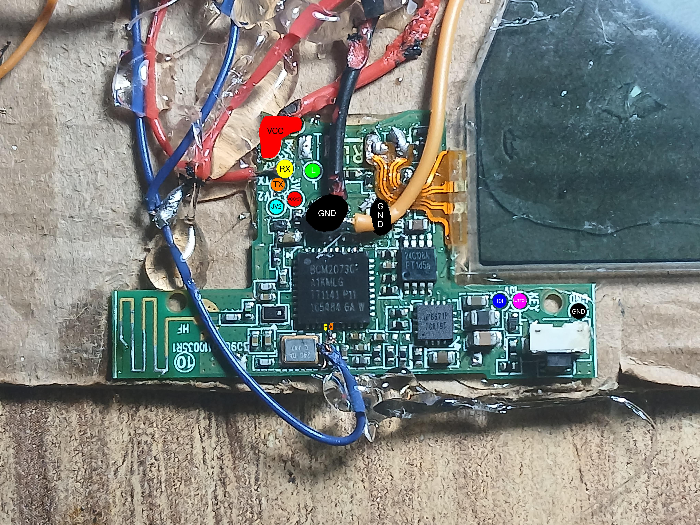
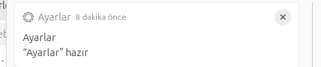

# Pads
(Red) VCC: Name explains it.
 
(Black) GND: Ground.
 
(Yellow) RX: UART receive pin.
 
(Orange) TX: Uart transmit pin.
 
(Cyan) JV2: Unknown, maybe a jumper.
 
(Green) L: Unknown.
 
(Blue) 10I: Unknown.
 
(Magenta) BUTTON/KEY: Button. Short to gnd in order to simulate button click.
 
# Chips
BCM20730 : Broadcom SoC. Cortex-M3 based
 
24C128A: 16 Kilobytes EEPROM.
 
uP6671P: PMIC chip.
 
SoC pinout:

